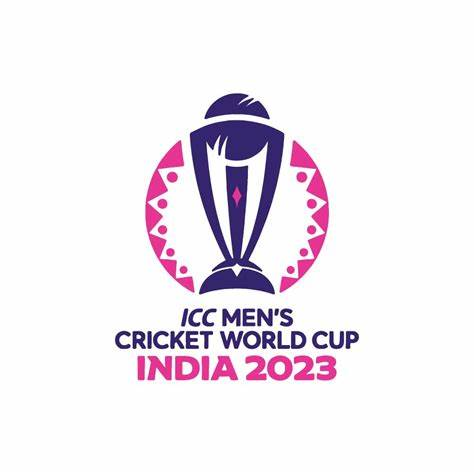
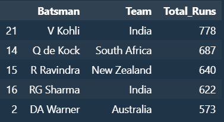

# WorldCup_prediction
In this task we are going to predict top 5 batsmen with most runs in World Cup 2023.

## Dataset Details

This task consists of 6 parts:
1. Introduction
2. Dataset Collection
3. Data visualization
4. Preprocessing
5. Modeling
6. Predicting top 5 batsmen with most runs

   
DATASET:
1. **Date:** Date of the match
2. **winner:** Winning team of the match
3. **Inning:** 1st inning or 2nd
4. **Team:** Name of batting team
5. **Over:** No. of current over
6. **Balls:** No. of balls
7. **Batsman:** Player on strike
8. **Bowler:** Player who bowls from the opposing team
9. **Non_strike:** Player on the non-strike
10. **Runs:** Runs scored by current Batsman
11. **Extras:** Total Extra runs in current ball
12. **Total_runs:** Total runs scored in current ball
13. **Wicket:** Batsman out or Not out
14. **Wicket_type:** How did the batsman get out (i.e, catch out, run out, etc)
15. **Venue:** Venue of the match

## Model Results

## Contributor

Krupesh Parmar - 202101160

   

   
